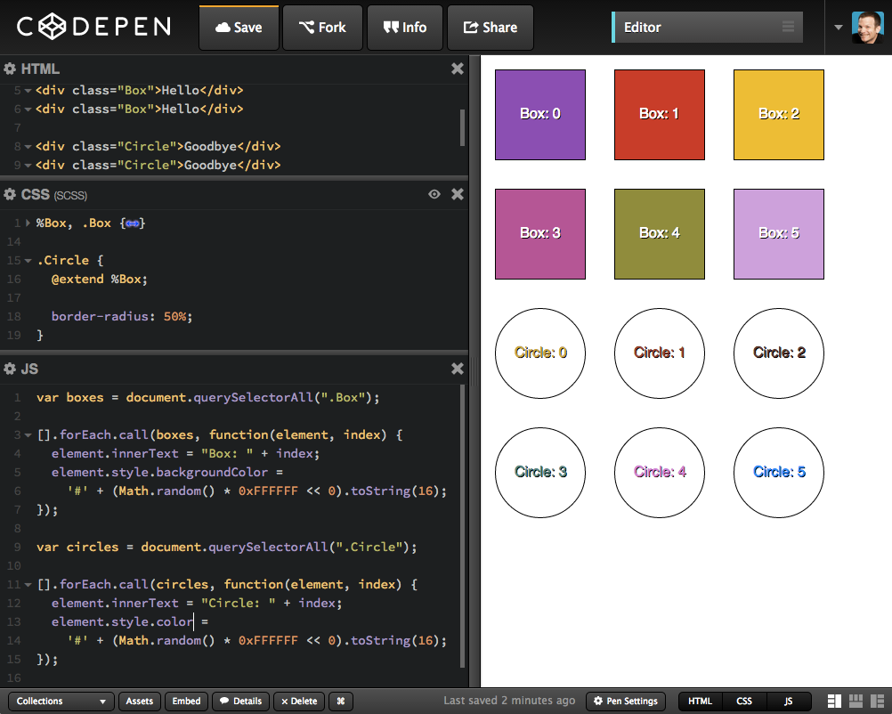

## SMELL CODE

### EXAMPLE1 :

1. If starts with consonant (or consonant cluster), then move the end and append "ay"
 "pig"    → "igpay"
"banana" → "ananabay"
"trash"  → "ashtray"
"happy"  → "appyhay"
"glove"  → "oveglay"
2. If starts with vowel or silent letter, then keep word along and append "way"
 "egg"    → "eggway"
"inbox"  → "inboxway"
"eight"  → "eightway"


```
function englishToPigLatin(english) {
  /* const */ var SYLLABLE = 'ay';
  var pigLatin = '';

  if (english !== null && english.length > 0 &&
    (VOWELS.indexOf(english[0]) > -1 ||
    CONSONANTS.indexOf(english[0]) > -1 )) {
    if (VOWELS.indexOf(english[0]) > -1) {
      pigLatin = english + SYLLABLE;
    } else {
      var preConsonants = '';
      for (var i = 0; i < english.length; ++i) {
        if (CONSONANTS.indexOf(english[i]) > -1) {
          preConsonants += english[i];
          if (preConsonants == 'q' &&
            i+1 < english.length && english[i+1] == 'u') {
            preConsonants += 'u';
            i += 2;
            break;
          }
        } else { break; }
      }
      pigLatin = english.substring(i) + preConsonants + SYLLABLE;
    }
  }

  return pigLatin;
}

```
SMELL REASONS: 

- too many statement 
- too much depth 
- too much complexity

lint results of above case.
max-statements:[2, 16]
max-depth:[2, 5]
complexity:[2, 7]
max-len:[2, 65]
max-params:[2, 1]
max-nested-callbacks:[2, 0] (ESLint Only)

for this case, js lint rules : 

/* jshint maxstatement:15, maxdepth:2, maxcomplexity:5*/

/*eslint max-statements:[2,15] , max-depth: [1,2] complextiy: [2, 5]*/

REFACTOR

```
const CONSONANTS = ['th', 'qu', 'b', 'c', 'd', 'f', 'g', 'h', 'j', 'k',
'l', 'm', 'n', 'p', 'q', 'r', 's', 't', 'v', 'w', 'x', 'y', 'z'];
const VOWELS = ['a', 'e', 'i', 'o', 'u'];
const ENDING = 'ay';

let isValid = word => startsWithVowel(word) || startsWithConsonant(word);
let startsWithVowel = word => !!~VOWELS.indexOf(word[0]);
let startsWithConsonant = word => !!~CONSONANTS.indexOf(word[0]);
let getConsonants = word => CONSONANTS.reduce((memo, char) => {
  if (word.startsWith(char)) {
    memo += char;
    word = word.substr(char.length);
  }
  return memo;
}, '');

function englishToPigLatin(english='') {
   if (isValid(english)) {
      if (startsWithVowel(english)) {
        english += ENDING;
      } else {
        let letters = getConsonants(english);
        english = `${english.substr(letters.length)}${letters}${ENDING}`;
      }
   }
   return english;
}
```
RESOURCES: 

jshint - http://jshint.com/
eslint - http://eslint.org/
jscomplexity - http://jscomplexity.org/
escomplex - https://github.com/philbooth/escomplex
jasmine - http://jasmine.github.io/

### COPE PASTE CODE SMELL 



REFACTOR

```
let randomColor = () => `#${(Math.random() * 0xFFFFFF << 0).toString(16)};

let $$ = selector => [].slice.call(document.querySelectorAll(selector || '*'));

let updateElement = (selector, textPrefix, styleProperty) => {
  $$(selector).forEach((element, index) => {
    element.innerText = textPrefix + ': ' + index;
    element.style[styleProperty] = randomColor();
  });
}

updateElement('.Box', 'Box', 'backgroundColor'); // 12: Refactored

updateElement('.Circle', 'Circle', 'color'); // 14: Refactored

```
RESOURCES:

- jsinspect https://github.com/danielstjules/jsinspect
- jscpd https://github.com/kucherenko/jscpd

### MAGIC STRINGS

```
function getArea(shape, options) {
  var area = 0;

  switch (shape) {
    case 'Triangle': // 5: Magic String
      area = .5 * options.width * options.height;
      break;
    /* ... more code ... */
  }

  return area;
}

getArea('Triangle', { width: 100, height: 100 }); // 14: Magic String

```
REFACTOR BY OBJECG TYPE

```
var shapeType = {
  triangle: 'Triangle' // 2: Object Type
};

function getArea(shape, options) {
  var area = 0;
  switch (shape) {
    case shapeType.triangle: // 8: Object Type
      area = .5 * options.width * options.height;
      break;
  }
  return area;
}

getArea(shapeType.triangle, { width: 100, height: 100 });

var shapeType = {
  triangle: 'Triangle' // 2: Object Type
};

function getArea(shape, options) {
  var area = 0;
  switch (shape) {
    case shapeType.triangle: // 8: Object Type
      area = .5 * options.width * options.height;
      break;
  }
  return area;
}

getArea(shapeType.triangle, { width: 100, height: 100 });

```

### THE THIS ABYSS SMELL

```
function Person() {
  this.teeth = [{ clean: false }, { clean: false }, { clean: false }];
};

Person.prototype.brush = function() {
  var that = this;

  this.teeth.forEach(function(tooth) {
    that.clean(tooth);
  });

  console.log('brushed');
};

Person.prototype.clean = function(tooth) {
  tooth.clean = true;
}

var person = new Person();
person.brush();
console.log(person.teeth);

```

REFACTOR

1. BIND

```
Person.prototype.brush = function() {
  this.teeth.forEach(function(tooth) {
    this.clean(tooth);
  }.bind(this)); // 4: Use .bind() to change context

  console.log('brushed');
};
```
2. 2ND PARAMETER OF FOREACH

```
Person.prototype.brush = function() {
  this.teeth.forEach(function(tooth) {
    this.clean(tooth);
  }, this); // 4: Use 2nd parameter of .forEach to change context

  console.log('brushed');
};

```
3. ES6

```
Person.prototype.brush = function() {
  this.teeth.forEach(tooth => { // 2: Use ES6 Arrow Function to bind `this`
    this.clean(tooth);
  });

  console.log('brushed');
};
```

4. FUNCTION PROGRAMING

```
Person.prototype.brush = function() {
  this.teeth.forEach(this.clean); // 2: Use functional programming

  console.log('brushed');
};

Person.prototype.brush = function() {
  this.teeth.forEach(this.clean.bind(this)); // 2: Bind `this` if clean needs it

  console.log('brushed');
};

```
### CRISP CONCATENTION SMEll

```
var build = function(id, href, text) {
  return $( "<div id='tab'><a href='" + href + "' id='" + id + "'>" +
    text + "</a></div>" );
}
```
REFACTOR
1. Tweet Sized JavaScript Templating Engine

```
function t(s, d) {
  for (var p in d)
    s = s.replace(new RegExp('{' + p + '}', 'g'), d[p]);
  return s;
}

var build = function(id, href, text) {
  var options = {
    id: id,
    href: href,
    text: text
  };

  return t('<div id="tab"><a href="{href}" id="{id}">{text}</></div>', options);
}
```
2， ES6 template string

```
var build = (id, href, text) =>
  `<div id="tab"><a href="${href}" id="${id}">${text}</a></div>`;

var build = (id, href, text) => SanitizeHTML`<div id="tab">
  <a href="${href}" id="${id}">${text}</a>
</div>`;

```

ESLint plugin:

no-complex-string-contact  http://bit.ly/eslint-plugin-smells
ES6 http://babeljs.io/docs/learn-es6/

### TEMPERAMENTAL TIMER SMELL

```
setInterval(function() {
  console.log('start setInterval');
  someLongProcess(getRandomInt(2000, 4000));
}, 3000);

function someLongProcess(duration) {
  setTimeout(
    function() { console.log('long process: ' + duration); },
    duration
  );  
}

function getRandomInt(min, max) {
  return Math.floor(Math.random() * (max - min + 1)) + min;
}
```

###REPEAT REASSIGN SMELL

```
data = this.appendAnalyticsData(data);
data = this.appendSubmissionData(data);
data = this.appendAdditionalInputs(data);
data = this.pruneObject(data);

```
REFACTOR

```
1. data = this.pruneObject(
  this.appendAdditionalInputs(
    this.appendSubmissionData(
      this.appendAnalyticsData(data)
    )
  )
);

2. var funcs = [
  this.appendAnalyticsData,
  this.appendSubmissionData,
  this.appendAdditionalInputs,
  this.pruneObject
];

funcs.forEach(function(func) {
  data = func(data);
});

3. var funcs = [
  this.appendAnalyticsData,
  this.appendSubmissionData,
  this.appendAdditionalInputs,
  this.pruneObject
];

data = funcs.reduce(function(memo, func) {
  return func(memo);
}, data);

4. 
data = _.flow(
  this.appendAnalyticsData,
  this.appendSubmissionData,
  this.appendAdditionalInputs,
  this.pruneObject
)(data);

```

### INAPPROPRIATE INTELLIGENCE SMELL

```
function ShoppingCart() { this.items = []; }
ShoppingCart.prototype.addItem = function(item) {
  this.items.push(item);
};

function Product(name) { this.name = name; }
Product.prototype.addToCart = function() {
  shoppingCart.addItem(this);
};

var shoppingCart = new ShoppingCart();
var product = new Product('Socks');
product.addToCart();
console.log(shoppingCart.items);

```

REFACTOR:
1. dependence injection

```
function ShoppingCart() { this.items = []; }
ShoppingCart.prototype.addItem = function(item) {
  this.items.push(item);
};

function Product(name, shoppingCart) { // 6: Accept Dependency
  this.name = name;
  this.shoppingCart = shoppingCart; // 8: Save off Dependency
}
Product.prototype.addToCart = function() {
  this.shoppingCart.addItem(this);
};

var shoppingCart = new ShoppingCart();
var product = new Product('Socks', shoppingCart); // 15: Pass in Dependency
product.addToCart();
console.log(shoppingCart.items);
```
2. message broker

```
var channel = postal.channel(); // 1: Broker

function ShoppingCart() {
  this.items = [];
  channel.subscribe('shoppingcart.add', this.addItem); // 5: Listen to Message
}
ShoppingCart.prototype.addItem = function(item) {
  this.items.push(item);
};

function Product(name) { this.name = name; }
Product.prototype.addToCart = function() {
  channel.publish('shoppingcart.add', this); // 13: Publish Message
};

var shoppingCart = new ShoppingCart();
var product = new Product('Socks');
product.addToCart();
console.log(shoppingCart.items);

```

### INCESSANT INTERACTION SMELL

```
var search = document.querySelector('.Autocomplete');

search.addEventListener('input', function(e) {
  // Make Ajax call for autocomplete

  console.log(e.target.value);
});

```

REFACTOR

```

var search = document.querySelector('.Autocomplete');

search.addEventListener('input', _.throttle(function(e) {
  // Make Ajax call for autocomplete

  console.log(e.target.value);
}, 500));

var search = document.querySelector('.Autocomplete');

search.addEventListener('input', _.debounce(function(e) {
  // Make Ajax call for autocomplete

  console.log(e.target.value);
}, 500));
```

### ANONYMOUS ALGORITHM SMELL


```
var search = document.querySelector('.Autocomplete');

search.addEventListener('input', _.throttle(function(e) {
  // Make Ajax call for autocomplete

  console.log(e.target.value);
}, 500));

````
reactor

```
 var kaboom = function() { alert('Ka-boom'); };

document.querySelector('button').addEventListener('click', kaboom);

document.querySelector('#egg').addEventListener('mouseenter', kaboom);

document.querySelector('button')
  .addEventListener('click', function handler() {
      alert('Ka-boom!');
    this.removeEventListener('click', handler);
  });

var search = document.querySelector('.Autocomplete');

search.addEventListener('input', _.debounce(function matches(e) {
  console.log(e.target.value);
}, 500));

```

### UNCONFIRMED CODE SMELL

```
$(document).ready(function() {
  // wire up event handlers

  // declare all the things

  // etc...
});
```

make it hard to do unit test

refactor:

singleton module

```
(function(myApp) {
  myApp.init = function() {
    // kick off your code
  };

  myApp.handleClick = function() {}; // etc...
}(window.myApp = window.myApp || {}));

// Only include at end of main application...
$(document).ready(function() {
  window.myApp.init();
});

var Application = (function() {
  function Application() {
    // kick off your code
  }

  Application.prototype.handleClick = function() {};

  return Application;
}());

// Only include at end of main application...
$(document).ready(function() {
  new Application();
});

```


